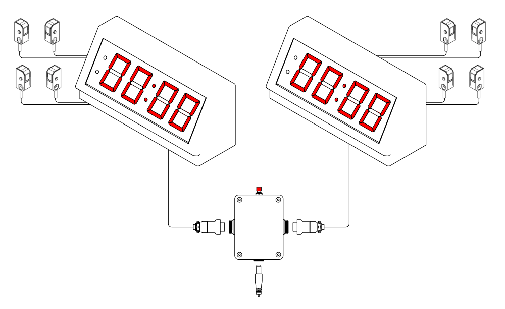
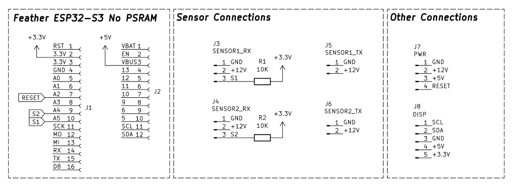
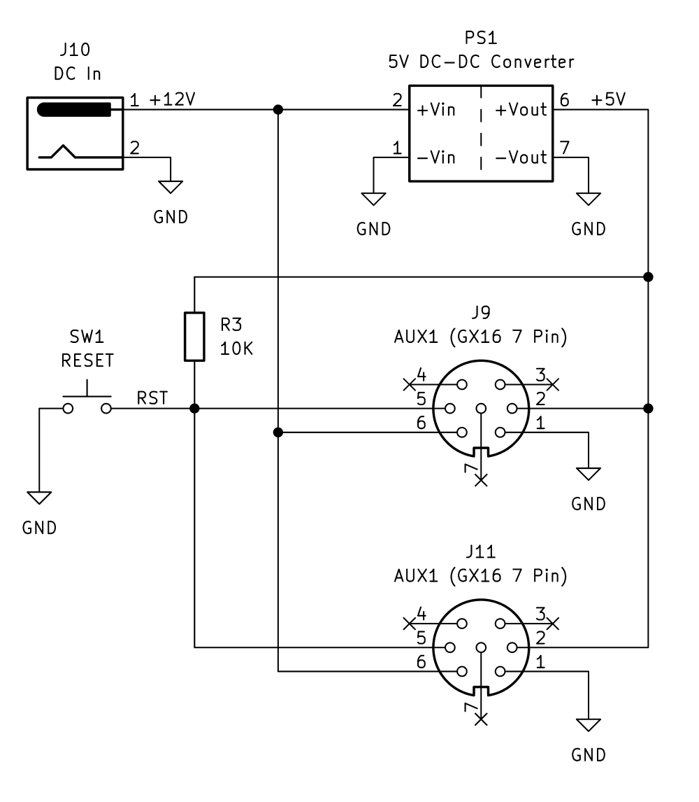

# ESP32 7-Segment Race Timer

[![CC BY-SA 4.0][cc-by-sa-shield]][cc-by-sa]

## Overview

A race timing system built with an ESP32-S3 microcontroller and LED display that measures elapsed time between start and finish sensors.

The connection box can provide power to multiple timer modules, and provides a reset button to reset all modules at once.

The system is designed to be easy to use and assemble. The timer modules are designed to be mounted to a table, and all wiring is run underneath the table.

The timer modules are connected to the connection box with a removable connector, so each module can be transported individually.

If more than 2 modules are needed, the connection box can be easily extended with additional connectors.

## Operation

Two light barriers are connected to each timer module, each consisting of a transmitter and receiver.

The START barrier is mounted at the beginning of the race track.
The STOP barrier is mounted at the end of the race track.

When the START barrier is interrupted, the current time measurement is reset and a new timing begins.

When the STOP barrier is interrupted while timing is active, the timing stops and the final time is shown on the display.

If a timing measurement exceeds 100 seconds, the time can no longer be fully displayed. The seconds display resets to 00: and timing continues.

When the RESET button is pressed at any time, the current timing is stopped and the display immediately resets to 00:00.

## Firmware development and flashing

The firmware is developed using the Arduino Platform on PlatformIO. The project is configured for the Adafruit ESP32-S3 Feather board.

### Dependencies

The following libraries are required and will be automatically installed by PlatformIO:

- Wire
- Adafruit LED Backpack Library

### Building and Flashing

1. Install VS Code and the PlatformIO extension
2. Clone this repository
3. Open the project folder in VS Code
4. Connect the Feather Board via USB
5. Click the PlatformIO "Upload" button or press Ctrl+Alt+U

The serial monitor can be opened at 115200 baud to view debug messages.

## Schematics

See also the KiCad project in the `hardware` folder.

**FeatherWing Schematic**

**Connection Box Schematic**

## Bill of Materials

**Per Timer Module**

- 1x 3d printed enclosure (See hardware folder)
- 4x M3 5mm threaded inserts
- 4x M4x6mm threaded inserts
- 4x M3x8mm hex screws
- 4x M4 mounting bolts
- 1x Adafruit ESP32-S3 Feather board (No PSRAM)
- 2x DFRobot Infrared Light Barrier Kit ([SEN0347](https://www.dfrobot.com/product-2057.html))
- 1x Race Timer FeatherWing (See hardware folder)
    - 1x Race Timer FeatherWing PCB 
    - 2x 16-Pin 2.54mm pin headers
    - 1x 5-Pin 2.54mm pin header
    - 2x JST-XH 2.50mm B2B (2-Pin)
    - 2x JST-XH 2.50mm B3B (3-Pin)
    - 1x JST-XH 2.50mm B4B (4-Pin)
    - 2x 10K 1/4W THT Resistor
- 2x JST-XH 2.50mm B2B (2-Pin) Female Connector
- 2x JST-XH 2.50mm B3B (3-Pin) Female Connector
- 1x JST-XH 2.50mm B4B (4-Pin) Female Connector
- 1x GX16 7-Pin Female Connector
- 4-core 20AWG cable to the connection box

**Connection Box**

- 1x 3d printed enclosure (See hardware folder)
- 4x M3 5mm threaded inserts
- 4x M3x8mm hex screws
- 1x Mini360 DC-DC Converter (or similar) 9-24V to 5V
- 2x GX16 7-Pin Male Connector
- 1x DC00990 Panel mount 5.5x2.1mm barrel jack connector
- 1x Generic 8mm panel mount push button switch
- 1x 12V 1A Power Supply 5.5x2.1mm barrel jack, center positive
- Wires for internal connections

## License

This work is licensed under a
[Creative Commons Attribution-ShareAlike 4.0 International License][cc-by-sa].

[![CC BY-SA 4.0][cc-by-sa-image]][cc-by-sa]

[cc-by-sa]: http://creativecommons.org/licenses/by-sa/4.0/
[cc-by-sa-image]: https://licensebuttons.net/l/by-sa/4.0/88x31.png
[cc-by-sa-shield]: https://img.shields.io/badge/License-CC%20BY--SA%204.0-lightgrey.svg